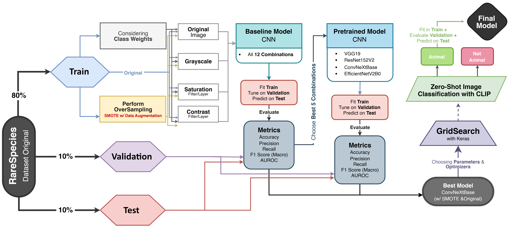

# 🌿 Predicting Rare Species from Images using Deep Learning 🐦🦋

Work developed for the **Deep Learning** course in the **Master's in Data Science and Advanced Analytics** at **NOVA IMS** (Spring Semester 2024-2025).

    

## **📝 Description**

This project applies advanced **Deep Learning** techniques to tackle the challenge of **rare species classification from images**. Using the **BioCLIP dataset**, sourced from the [Encyclopedia of Life (EOL)](https://eol.org/), which contains over 11,000 images across 202 animal families and associated taxonomic metadata (`kingdom`, `phylum`, `family`), we developed a robust pipeline to preprocess imbalanced and noisy data, train multiple neural network architectures, and deploy an innovative zero-shot classification approach to improve model performance. The ultimate goal is to create a tool that can aid in biodiversity conservation through automated species identification.

## **✨ Objective**

The primary objective is to develop a highly accurate image classification model by:

-   **Exploring** the complex BioCLIP dataset to understand its structure and inherent challenges, such as severe class imbalance.
-   **Preprocessing** images and implementing data augmentation strategies to create a robust training pipeline.
-   **Developing and evaluating** multiple deep learning models, from a baseline CNN to state-of-the-art pre-trained architectures.
-   **Innovating** with a zero-shot classification pre-filtering step to remove noisy data and enhance model accuracy.

## **🎓 Project Context**

This project was developed for the **Deep Learning** course in the **[Master's in Data Science and Advanced Analytics](https://www.novaims.unl.pt/en/education/programs/postgraduate-programs-and-master-degree-programs/master-degree-program-in-data-science-and-advanced-analytics-with-a-specialization-in-data-science/)** program at **NOVA IMS**, during the **2nd Semester** of the 2024/2025 academic year.

## **💾 Data Source**

The dataset is derived from the **BioCLIP** project, with images and metadata sourced from the **[Encyclopedia of Life (EOL)](https://eol.org/)**.

*   **Dataset:** **11,983 images** of rare species.
*   **Target:** Classification across **202 unique `family` labels** within the `Animalia` kingdom.
*   **Source Links:** [BioCLIP Project](https://imageomics.github.io/bioclip/)

## **🏗️ Project Workflow** (Adapted from the **CRISP-DM** methodology)

The project follows the **CRISP-DM** framework, adapted for deep learning, guiding the process from problem understanding to deployment.

    

<b>Figure 1:</b> Project Flowchart.

1.  **Business Understanding:** 💡
    - **Problem:** Classify rare species images into their `family` based on visual features.
    - **Importance:** Automate species identification to aid biodiversity conservation.
    - **Data Source:** BioCLIP dataset with `family` as the target variable.

    
    

2.  **Data Understanding:** 🔍
    - **Dataset:** 11,983 images, 7 metadata features, 202 families, all within `Animalia`.
    - **Challenges:** High class imbalance ([Figure B2](./DL_Group37_Report.pdf)), potential non-animal outliers ([Figure B3](./DL_Group37_Report.pdf)).
    - **Exploration:** Verified data types, checked for missing values/duplicates, and visualized family distribution.
    - **Splitting:** Stratified split into 80% training, 10% validation, 10% test sets.

    
    
    
    
    

3.  **Data Preparation:** 🛠️

    - **Image Preprocessing:** Resized to **224x224**, maintained **RGB** mode, preserved aspect ratios.
    - **Class Imbalance:** Applied **SMOTE-inspired augmentation** (Keras `RandAugment`, Figure B6) and **class weighting**.
    - **Transformations:** Explored grayscale, contrast, and saturation adjustments (Figure B5).
      - **Notebook:**
        - [`1_BU&EDA&FE_DLProject_Group37.ipynb`](./1_BU&EDA&FE_DLProject_Group37.ipynb)
        - [`2_ImagePreprocessing&DataAugmentation_DLProject_Group37.ipynb`](./2_ImagePreprocessing&DataAugmentation_DLProject_Group37.ipynb)

    
    
    

4.  **Modeling:** 🤖
    - **Baseline CNN:** Built a custom CNN using Keras Functional API (Figure C1).
    - **Transfer Learning:** Tested pre-trained models (**VGG19**, **ResNet152V2**, **ConvNeXtBase**, **EfficientNetV2B0**) with frozen base layers and custom classification heads (Annex—A).
    - **Experiments:** Evaluated combinations of preprocessing (original, contrast, saturation) and imbalance handling (original, SMOTE, class weights; [Tables C1 & C2](./DL_Group37_Report.pdf)).
    - **Hyperparameter Tuning:** Used **Keras Tuner** (Hyperband strategy, [Annex B](./DL_Group37_Report.pdf)) to optimize the best model (`ConvNeXtBase`), tuning learning rate, optimizer, and dropout ([Table D1](./DL_Group37_Report.pdf)).
  
      - **Notebooks:**
        - [`3_Modeling_Baseline_Model_DLProject_Group37.ipynb`](./3_Modeling_Baseline_Model_DLProject_Group37.ipynb)
        - [`4_Modeling_VGG-19_DLProject_Group37.ipynb`](./4_Modeling_VGG-19_DLProject_Group37.ipynb)
        - [`5_Modeling_ResNet50V2_DLProject_Group37.ipynb`](./5_Modeling_ResNet50V2_DLProject_Group37.ipynb)
        - [`6_Modeling_ConvNeXt_DLProject_Group37.ipynb`](./6_Modeling_ConvNeXt_DLProject_Group37.ipynb)
        - [`7_Modeling_EfficientNetB0_DLProject_Group37.ipynb`](./7_Modeling_EfficientNetB0_DLProject_Group37.ipynb)
        - [`8_TuningBestModel_DLProject_Group37.ipynb`](./8_TuningBestModel_DLProject_Group37.ipynb)

    
    
    
    
     

5.  **Evaluation:** ✅
    - **Metrics:** **Macro F1-Score** (primary due to imbalance), **Accuracy**, **Precision**, **Recall**, **AUROC**.
    - **Analysis:** Learning curves (Figure F1) assessed generalization; confusion matrices (Figure F4) and qualitative examples (Figures F2 & F3) identified misclassification patterns (e.g., visually similar species, poor image quality).
    - **Callbacks:** Used `ModelCheckpoint`, `CSVLogger`, `LearningRateScheduler`, `EarlyStopping`.

6.  **Deployment:** 🚀
    - **Deliverables:** Code, notebooks, and a comprehensive report detailing methodology and findings.

## ✨ Innovative Approach: Zero-Shot Image Classification with CLIP 🚀

- **Method:** Applied **CLIP** (`clip-vit-base-patch16`) for zero-shot classification to filter non-animal images (~15% of the dataset, [Figure E2](./DL_Group37_Report.pdf); [Annex E](./DL_Group37_Report.pdf)).
- **Impact:** Retrained the best model (`ConvNeXtBase` with SMOTE) on the filtered **"OnlyAnimals"** dataset, improving robustness and reducing overfitting.
  - **Notebooks:**
    - [`9_InnovativeApproaches_DLProject_Group37.ipynb`](./9_InnovativeApproaches_DLProject_Group37.ipynb)
    - [`10_InnovativeApproachesModels_DLProject_Group37.ipynb`](./10_InnovativeApproachesModels_DLProject_Group37.ipynb)

    

## **📈 Results & Conclusion**

> The **ConvNeXtBase model**, trained on the **CLIP-filtered "OnlyAnimals" dataset** with **SMOTE-inspired augmentation**, emerged as the top-performing solution. It achieved a final **Accuracy of 83.1%** and a **Macro F1-Score of 78.7%** on the hold-out test set. This project demonstrates that a combination of advanced transfer learning, innovative data cleaning with zero-shot models, and robust imbalance handling can create a powerful and scalable solution for automated species classification, directly supporting biodiversity conservation efforts.

Feel free to explore the notebooks to see the implementation details of each phase!

 

## **📂 Repository Structure**

1.  **Data & Image Preparation**
    *   [**`1_BU&EDA&FE_DLProject_Group37.ipynb`**](./1_BU&EDA&FE_DLProject_Group37.ipynb)
    *   [**`2_ImagePreprocessing&DataAugmentation_DLProject_Group37.ipynb`**](./2_ImagePreprocessing&DataAugmentation_DLProject_Group37.ipynb)

2.  **Baseline Model - CNN**
    *   [**`3_Modeling_Baseline_Model_DLProject_Group37.ipynb`**](./3_Modeling_Baseline_Model_DLProject_Group37.ipynb)

3.  **Pre-trained Models**
    *   [**`4_Modeling_VGG-19_DLProject_Group37.ipynb`**](./4_Modeling_VGG-19_DLProject_Group37.ipynb)
    *   [**`5_Modeling_ResNet50V2_DLProject_Group37.ipynb`**](./5_Modeling_ResNet50V2_DLProject_Group37.ipynb)
    *   [**`6_Modeling_ConvNeXt_DLProject_Group37.ipynb`**](./6_Modeling_ConvNeXt_DLProject_Group37.ipynb)
    *   [**`7_Modeling_EfficientNetB0_DLProject_Group37.ipynb`**](./7_Modeling_EfficientNetB0_DLProject_Group37.ipynb)

4.  **Tuning Best Model**
    *   [**`8_TuningBestModel_DLProject_Group37.ipynb`**](./8_TuningBestModel_DLProject_Group37.ipynb)

5.  **Innovative Approach**
    *   [**`9_InnovativeApproaches_DLProject_Group37.ipynb`**](./9_InnovativeApproaches_DLProject_Group37.ipynb)
    *   [**`10_InnovativeApproachesModels_DLProject_Group37.ipynb`**](./10_InnovativeApproachesModels_DLProject_Group37.ipynb)

 

## 👥 Team Members (Group 37)

- André Silvestre, 20240502
- Diogo Duarte, 20240525
- Filipa Pereira, 20240509
- Maria Cruz, 20230760
- Umeima Adam Mahomed, 20240543
